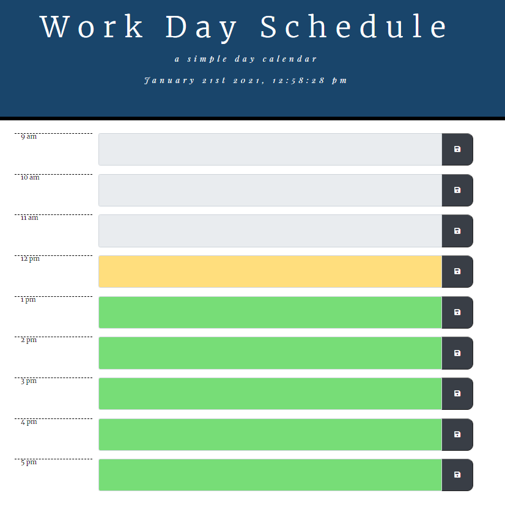

Try the quiz at this link: https://tonyrpark.github.io/05-ThirdPartyAPI-WorkDayScheduler-TonyPark/

# Files

---

# Main files:

1. index.html
2. css/styles.css
3. assets/planner.js

---

## Planner Elements

- 9am-5pm Time Slot
- Events in the past cannot be edited
- After saving an event and refreshing, metadata stored in localStorage
- Uses momentum cdn to pull in time

### Screenshots

© Tony Park 2021
